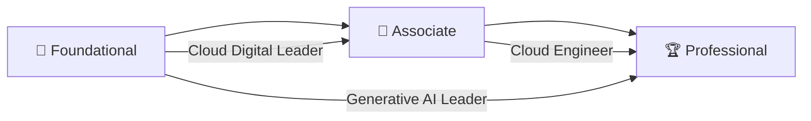

# ☁️ GCP Cert Vault

### Curated Practice Tests & Exam Prep for Every Google Cloud Certification

*A single, organized jumping-off point for Google Cloud practice exams — from Foundational to Professional level.*

---

## 📖 About

This repository is a hand-curated index of **Udemy practice test courses** for the full **Google Cloud certification track** — Foundational, Associate, and Professional levels. Instead of hunting across Udemy for the right exam simulator, use the table below to jump straight to the course that matches the certification you're studying for.

> 💡 **Tip:** Links may include promotional coupon codes. Prices and discounts can change or expire at any time — always double-check the final price at checkout.

---

## 📑 Table of Contents

- [🏆 Professional Certifications](#-professional-certifications)
- [🥈 Associate Certifications](#-associate-certifications)
- [🌱 Foundational Certifications](#-foundational-certifications)
- [🚀 How to Use](#-how-to-use)
- [🗺️ Suggested Learning Path](#️-suggested-learning-path)
- [🤝 Contributing](#-contributing)
- [⚠️ Disclaimer](#️-disclaimer)
- [📄 License](#-license)

---

## 🏆 Professional Certifications

| Certification | Course | Link |
|---|---|---|
| ☁️ Professional Cloud Architect | Google Professional Architect Practice Tests 2026 | [Enroll →](https://www.udemy.com/course/google-cloud-architect-practice-tests-2026/?couponCode=D172CB17E46336821317) |
| 🤖 Professional Cloud Agentic Architect *(Beta)* | Google Professional Cloud Agentic Architect (Beta) | [Enroll →](https://www.udemy.com/course/professional-agentic-architect-practice-tests-2026-gcloud/?referralCode=74BA83F00A79D30959CA) |
| 🗄️ Professional Cloud Database Engineer | Google Professional Cloud Database Engineer | [Enroll →](https://www.udemy.com/course/professional-data-engineer-practice-test/?referralCode=82E5AFB6DBAFD2387D2B) |
| 💻 Professional Cloud Developer | Google Professional Cloud Developer | [Enroll →](https://www.udemy.com/course/professional-cloud-developer-practice-test/?referralCode=FBF269B996FA96160CA8) |
| 📊 Professional Data Engineer | Google Professional Data Engineer | [Enroll →](https://www.udemy.com/course/professional-data-engineer-practice-test/?referralCode=82E5AFB6DBAFD2387D2B) |
| 🔁 Professional Cloud DevOps Engineer | Google Professional Cloud DevOps Engineer | [Enroll →](https://www.udemy.com/course/professional-cloud-devops-engineer-practice-test/?referralCode=903CAE7E6F5F5B5B7EB7) |
| 🔐 Professional Cloud Security Engineer | Google Professional Cloud Security Engineer | [Enroll →](https://www.udemy.com/course/professional-security-operations-engineer-practice-test/?referralCode=7EE619AD56072B873ECF) |
| 🌐 Professional Cloud Network Engineer | Google Professional Cloud Network Engineer | [Enroll →](https://www.udemy.com/course/professional-cloud-network-engineer-practice-tests-2026/?referralCode=8151BDFD232F04AAB2BD) |
| 🧠 Professional Machine Learning Engineer | Google Professional Machine Learning Engineer | [Enroll →](https://www.udemy.com/course/google-cloud-professional-ml-engineer-practice-tests/?referralCode=BC75BBA051FD0149DE79) |
| 🛡️ Professional Security Operations Engineer | Google Professional Security Operations Engineer | [Enroll →](https://www.udemy.com/course/professional-security-operations-engineer-practice-test/?referralCode=7EE619AD56072B873ECF) |

## 🥈 Associate Certifications

| Certification | Course | Link |
|---|---|---|
| 📈 Associate Data Practitioner | Google Associate Data Practitioner Exam Prep | [Enroll →](https://www.udemy.com/course/google-associate-data-practitioner-exam-prep/?couponCode=GOOGLE) |
| ⚙️ Associate Cloud Engineer | Google Cloud Cloud Engineer | [Enroll →](https://www.udemy.com/course/google-associate-cloud-engineer-practice-tests-w/?referralCode=87EFB10146C44AF4E2F8) |
| 🧩 Associate Google Workspace Administrator | Google Associate Google Workspace Administrator | [Enroll →](https://www.udemy.com/course/google-workspace-administrator-practice-exams-g/?referralCode=2BA92BE2193A7E948355) |

## 🌱 Foundational Certifications

| Certification | Course | Link |
|---|---|---|
| 🧭 Cloud Digital Leader | Google Foundational Cloud Digital Leader | [Enroll →](https://www.udemy.com/course/google-cloud-digital-leader-practice-tests-cd/?referralCode=7D7B256B6F40516928BF) |
| ✨ Generative AI Leader | Google Foundational Generative AI Leader | [Enroll →](https://www.udemy.com/course/google-generative-ai-leader-practice-tests-i/?referralCode=749BE20C5604B682BEF4) |

---

## 🚀 How to Use

1. **Pick your target certification** from the tables above.
2. **Click "Enroll →"** to open the course on Udemy.
3. **Work through the practice tests** section by section, reviewing explanations for every missed question.
4. **Track your score trend** across attempts — aim for consistent 85%+ before sitting the real exam.
5. ⭐ **Star this repo** so you can find your prep material again later.

---

## 🗺️ Suggested Learning Path

New to Google Cloud? Start **Foundational → Associate → Professional**. Already have hands-on GCP experience? Feel free to jump straight into the Associate or Professional tier that matches your role.

---

## 🤝 Contributing

Found a broken link, an updated coupon code, or a new Google Cloud certification that's missing?

1. Fork this repository
2. Add or update the relevant table row
3. Open a pull request with a short description of the change

Contributions that keep this list accurate and up to date are always welcome!

---

## ⚠️ Disclaimer

- This repository is an independent, community-style index and is **not affiliated with or endorsed by Google or Udemy**.
- Coupon and referral codes are provided as-is, may expire without notice, and any discount shown at checkout is controlled entirely by Udemy.
- These are third-party practice tests intended as *supplementary* study material — always cross-reference with the [official Google Cloud certification exam guides](https://cloud.google.com/certification).

---

## 📄 License

The contents of this README (descriptions, formatting, organization) are released under **CC0 — Public Domain**. Course links and titles remain the property of their respective owners (Udemy / course instructors).

**Happy studying, and good luck on your exam! 🎓**

