### Your launchpad for passing Google Cloud certifications, from Foundational to Professional.

  
  
  
  

  <a href="#-course-catalog"><b>📚 Catalog</b></a> &nbsp;•&nbsp;
  <a href="#-certification-roadmap"><b>🧭 Roadmap</b></a> &nbsp;•&nbsp;
  <a href="#-pick-your-path"><b>🎯 Pick Your Path</b></a> &nbsp;•&nbsp;
  <a href="#-how-to-use-these-tests"><b>📝 Study Loop</b></a> &nbsp;•&nbsp;
  <a href="#-faq"><b>❓ FAQ</b></a> &nbsp;•&nbsp;
  <a href="#-meet-your-instructor"><b>👋 Instructor</b></a>

---

## ✨ Why These Practice Tests

<table>
  <tr>
    <td width="33%" valign="top">
      <h3>🎯 Exam-Style Scenarios</h3>
      Questions written to mirror the tone, length and case-study style of the real Google Cloud exams.
    </td>
    <td width="33%" valign="top">
      <h3>🧠 Every Option Explained</h3>
      Learn why the right answer is right <i>and</i> why each distractor is wrong, so you understand instead of memorizing.
    </td>
    <td width="33%" valign="top">
      <h3>🗂️ Domain-Mapped</h3>
      Coverage organized around each certification's official exam guide, so you can spot weak domains fast.
    </td>
  </tr>
  <tr>
    <td width="33%" valign="top">
      <h3>⏱️ Real Exam Pressure</h3>
      Timed attempts build the pacing and stamina you need on exam day.
    </td>
    <td width="33%" valign="top">
      <h3>🔁 Retake Freely</h3>
      Practice until your scores are consistent, not lucky.
    </td>
    <td width="33%" valign="top">
      <h3>📱 Study Anywhere</h3>
      Web, iOS or Android through the Udemy app: squeeze in a set on your commute.
    </td>
  </tr>
</table>

---

## 🧭 Certification Roadmap

```mermaid
flowchart LR
    subgraph F["🌱 FOUNDATIONAL"]
        direction TB
        F1["Cloud Digital Leader"]
        F2["Generative AI Leader"]
    end

    subgraph A["🚀 ASSOCIATE"]
        direction TB
        A1["Cloud Engineer"]
        A2["Data Practitioner"]
        A3["Workspace Administrator"]
    end

    subgraph P["🏆 PROFESSIONAL"]
        direction TB
        P1["🏛️ Architecture<br/>Cloud Architect · Agentic Architect (Beta)"]
        P2["🛠️ Build & Operate<br/>Developer · DevOps Engineer · Network Engineer"]
        P3["🔐 Security<br/>Security Engineer · Security Operations Engineer"]
        P4["📊 Data & AI<br/>Data Engineer · Database Engineer · ML Engineer"]
    end

    F ==> A ==> P

    classDef found fill:#E6F4EA,stroke:#34A853,stroke-width:2px,color:#0D652D
    classDef assoc fill:#E8F0FE,stroke:#4285F4,stroke-width:2px,color:#174EA6
    classDef pro fill:#FEF7E0,stroke:#F9AB00,stroke-width:2px,color:#7A4F01
    class F1,F2 found
    class A1,A2,A3 assoc
    class P1,P2,P3,P4 pro
```

> **Note:** Google Cloud certifications have no formal prerequisites. The levels above are a suggested progression based on experience, not a requirement.

---

## 📚 Course Catalog

> 🎟 = link currently includes a discount coupon. Coupons expire, so grab them while they're live.

### 🌱 Foundational

| # | Certification | Ideal For | Enroll |
|:-:|:--|:--|:-:|
| 1 | **Cloud Digital Leader** | Business, sales, product and other non-technical roles who need cloud fluency |  |
| 2 | **Generative AI Leader** | Leaders and decision-makers shaping Gen AI strategy on Google Cloud |  |

### 🚀 Associate

| # | Certification | Ideal For | Enroll |
|:-:|:--|:--|:-:|
| 3 | **Associate Cloud Engineer** | Hands-on engineers deploying and operating workloads on Google Cloud |  |
| 4 | **Associate Data Practitioner** 🎟 | Early-career data professionals working with data prep, analysis and ML basics |  |
| 5 | **Associate Google Workspace Administrator** | IT admins managing users, security and services in Google Workspace |  |

### 🏆 Professional

| # | Certification | Ideal For | Enroll |
|:-:|:--|:--|:-:|
| 6 | **Professional Cloud Architect** 🎟 | Designing secure, scalable, highly available solutions end to end |  |
| 7 | **Professional Cloud Agentic Architect**  | Architects designing agentic and multi-agent AI systems on Google Cloud |  |
| 8 | **Professional Cloud Developer** | Building and shipping cloud-native applications and APIs |  |
| 9 | **Professional Cloud DevOps Engineer** | SRE practices, CI/CD pipelines and service observability |  |
| 10 | **Professional Cloud Network Engineer** | VPC design, hybrid connectivity and network services |  |
| 11 | **Professional Cloud Security Engineer** | IAM, data protection and secure infrastructure design |  <!-- TODO: verify — same URL as Security Operations Engineer (#12) --> |
| 12 | **Professional Security Operations Engineer** | Detection engineering, threat hunting and incident response |  |
| 13 | **Professional Data Engineer** | Designing data processing systems and pipelines at scale |  |
| 14 | **Professional Cloud Database Engineer** | Designing, migrating and managing cloud databases |  <!-- TODO: verify — same URL as Data Engineer (#13) --> |
| 15 | **Professional Machine Learning Engineer** | Building, deploying and operationalizing ML models |  |

<a href="#top">⬆ Back to top</a>

---

## 🎯 Pick Your Path

Not sure where to start? Find the row that sounds like you. The **bold** exam is the headline target for that path.

| If you are… | Suggested path |
|:--|:--|
| ☁️ **Aspiring cloud architect** | Cloud Digital Leader → Associate Cloud Engineer → **Professional Cloud Architect** |
| 🤖 **AI / agent builder** | Generative AI Leader → Professional ML Engineer → **Professional Cloud Agentic Architect** |
| 📊 **Data professional** | Associate Data Practitioner → **Professional Data Engineer** → Professional Cloud Database Engineer |
| 🔐 **Security engineer** | Associate Cloud Engineer → **Professional Cloud Security Engineer** → Professional Security Operations Engineer |
| 🛠️ **Developer / DevOps / SRE** | Associate Cloud Engineer → **Professional Cloud Developer** → Professional Cloud DevOps Engineer |
| 🌐 **Network engineer** | Associate Cloud Engineer → **Professional Cloud Network Engineer** |
| 🗂️ **IT / Workspace admin** | **Associate Google Workspace Administrator** |
| 💼 **Business / non-technical** | **Cloud Digital Leader** → Generative AI Leader |

<a href="#top">⬆ Back to top</a>

---

## 📝 How to Use These Tests

**Attempt → Review → Fix → Retake → Book**

1. **Take a diagnostic run.** Attempt one full test cold, with no notes. The score is a baseline, not a verdict.
2. **Study every explanation.** Review all questions, including the ones you got right. A lucky guess is a hidden gap.
3. **Close the gaps.** Map your weak domains to the official exam guide, then fill them with Google Cloud docs and hands-on labs.
4. **Simulate exam day.** Retake in a single timed sitting, with no pausing and no second screen.
5. **Book when you're consistent.** Aim for 80%+ across several different tests before you schedule the real exam.

---

## ❓ FAQ

<b>Are these real exam questions or "dumps"?</b>

 
No. Every question is original and scenario-based, written against the published exam guides. Using leaked exam content violates Google's certification agreement, and it doesn't prepare you for the questions you'll actually see.

<b>Which certification should I start with?</b>

 
Check <a href="#-pick-your-path">Pick Your Path</a>. If you're brand new to cloud, Cloud Digital Leader is the gentlest entry point. If you already work hands-on with Google Cloud, go straight to Associate Cloud Engineer.

<b>Are practice tests enough on their own?</b>

 
For Associate and Professional exams, pair them with real hands-on time. Practice tests sharpen exam technique and expose gaps; labs and real projects build the skill the exam is testing.

<b>How do I get the best price?</b>

 
Links marked 🎟 include a coupon while it's valid, and Udemy runs frequent site-wide sales. Referral links in this repo directly support the instructor.

---

## 🤝 Feedback & Contributions

Spotted an outdated question, a typo, or an explanation that could be clearer? [Open an issue](../../issues) with the **course name** and **question number**. Every report makes the tests better for the next learner.

## 📜 Disclaimer

This repository and the linked courses are independent educational resources and are **not affiliated with, sponsored by, or endorsed by Google LLC**. Google Cloud, Google Workspace and related names are trademarks of Google LLC. Exam names, domains and formats change over time, so always confirm details on the official Google Cloud certification site before booking.

**If this helped your prep, drop a ⭐. It helps other learners find it.**

Made with ☁️ and ☕ by <b>Gen AI Guru</b>

